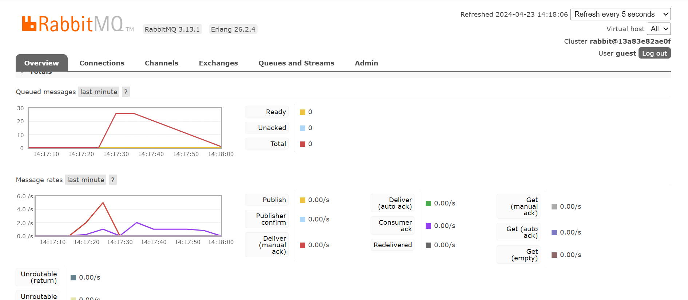

# Module 8: Software Architectures
## Tutorial Advanced Programming 2023/2024 Genap

* Nama  : Tengku Laras Malahayati
* NPM   : 2206081641
* Kelas : A

## Reflection
### What Is `amqp`?
AMQP (Advanced Message Queuing Protocol) is an open standard protocol that enables messaging between systems across different platforms. It is commonly used to facilitate the exchange of business messages between applications or organizations by connecting systems seamlessly.

### What it means? guest:guest@localhost:5672 , what is the first guest, and what is the second guest, and what is localhost:5672 is for?

* The first `guest` represents *username*, while the latter represents *password*. In this case, the *username* and *password* is guest. 
* `localhost:5672` indicates that the server is running on the default port for AMQP, which is port 5672.

## Simulation Slow Subscriber

The total number of queue in my machine is around 25. The number of messages queued in the message broker increases as the delay extends because the Publisher sends messages faster than the Subscriber can receive them.

## Reference

https://www.amqp.org/about/what

https://www.cloudamqp.com/blog/what-is-amqp-and-why-is-it-used-in-rabbitmq.html

https://www.cloudamqp.com/docs/amqp.html#:~:text=AMQP%20assigned%20port%20number%20is,open%20standard%20application%20layer%20protocol.